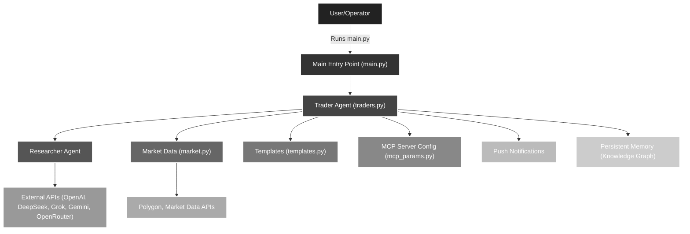

# 🚀 MCP Autonomous Traders

> **A modular, AI-powered framework for autonomous trading and financial research.**

---

## ✨ Overview
MCP Autonomous Traders is a next-generation Python framework for building, running, and experimenting with autonomous trading agents. It empowers both researchers and traders to automate research, trading, and portfolio management using state-of-the-art LLMs and real-time market data.

---

## 🛠️ Features
- **Modular agent & tool architecture**
- **Multi-LLM support:** OpenAI, DeepSeek, Grok, Gemini, OpenRouter
- **Researcher & trader agent roles**
- **Persistent memory & knowledge graph**
- **Automated trading & rebalancing workflows**
- **Push notifications & reporting**
- **.env-based configuration for API keys**

---

## 🖼️ Project Flow



---

## 🏗️ MCP Server & Tool Architecture

### MCP Servers
This project orchestrates multiple Model Context Protocol (MCP) servers to modularize and scale agentic workflows:

**Trader MCP Servers:**
- 🗃️ **Accounts Server** — Manages account data and resources
- 📣 **Push Notification Server** — Handles notifications and alerts
- 📈 **Market Data Server** — Provides real-time or historical market data (local or Polygon MCP)

**Researcher MCP Servers:**
- 🌐 **Fetch Server** — Retrieves web data for research
- 🔎 **Brave Search Server** — Integrates Brave search for financial/news research
- 🧠 **Memory Server** — Persistent memory for knowledge graph and context

> **Total unique MCP servers:** 6 (3 for trader, 3 for researcher)

### Agentic Tools
Agents in this framework leverage a variety of AI-powered tools:
- 🤖 **Researcher Tool** — Allows the trader to invoke the Researcher agent for deep research
- 🌍 **Research Tool** — Used by the Researcher for web/news/financial research
- 🧠 **Knowledge Graph Tools** — Store and recall information, build expertise over time
- 📊 **Financial Data Tools** — Access stock prices, company info, and market analytics
- 💸 **Trading Tools** — Execute trades, rebalance portfolios, manage assets
- 🗂️ **Entity Tools** — Persistent memory shared among agents

> The framework is extensible: you can add more tools and servers as your use case grows.

---

## 📦 Project Structure

```
main.py             # Entry point
traders.py          # Trader agent logic
trading_floor.py    # Automated trading floor (periodic agent execution)
app.py              # Gradio-based UI for interactive trading visualization
accounts.py         # Account and transaction management for traders
util.py             # UI utilities (CSS, JS, color definitions)
reset.py            # Resets all trader accounts and strategies to initial state
accounts_client.py  # Client for interacting with account MCP server
accounts_server.py  # MCP server for account management (balances, holdings, trades)
market_server.py    # MCP server for market data (share price lookup)
push_server.py      # MCP server for push notifications (Pushover integration)
market.py           # Market data logic and integration
mcp_params.py       # MCP server configuration
tracers.py          # Tracing and logging utilities
database.py         # Local database for accounts, logs, and market data
templates.py        # Prompt and message templates
```

---

## ⚡ Quickstart

### 1. Clone the repository
```sh
git clone <your-repo-url>
cd mcp-autonomous-traders
```

### 2. Install dependencies with [uv](https://github.com/astral-sh/uv)
```sh
uv sync
```
_Add any additional dependencies as needed:_
```sh
uv add <package-name>
```

### 3. Configure environment variables
Create a `.env` file in the project root:
```
OPENAI_API_KEY=your-openai-key
DEEPSEEK_API_KEY=your-deepseek-key
GROK_API_KEY=your-grok-key
GOOGLE_API_KEY=your-google-key
OPENROUTER_API_KEY=your-openrouter-key
BRAVE_API_KEY=your-brave-key
POLYGON_API_KEY=your-polygon-key
```

---

## ▶️ Usage
Run the main entry point:
```sh
uv run app.py
```

---

## 🚦 Run Modes

| Command                        | Description                                                      |
|--------------------------------|------------------------------------------------------------------|
| `uv run app.py`                | Launches the Gradio web UI for interactive trading visualization |
| `uv run trading_floor.py`      | Runs the automated trading floor (periodic agent execution)      |
| `uv run reset.py`              | Resets all trader accounts and strategies to initial state       |
| `uv run accounts_server.py`    | Runs the MCP server for account management (balances, trades)    |
| `uv run market_server.py`      | Runs the MCP server for market data (share price lookup)         |
| `uv run push_server.py`        | Runs the MCP server for push notifications (Pushover)            |
| _traders.py (not direct)_      | Core agent logic, imported by other scripts                      |

**Examples:**
```sh
uv run app.py             # Start the UI
uv run trading_floor.py   # Start the automated trading floor
uv run reset.py           # Reset all trader accounts and strategies
uv run accounts_server.py # Start the account MCP server
uv run market_server.py   # Start the market data MCP server
uv run push_server.py     # Start the push notification MCP server
```

---

## 🧩 Extending the Framework
- Add new agent types in `traders.py` or as new modules
- Customize prompts and workflows in `templates.py`
- Integrate new data sources via `market.py` and `mcp_params.py`

---

> _Empowering the next generation of autonomous trading and research._
