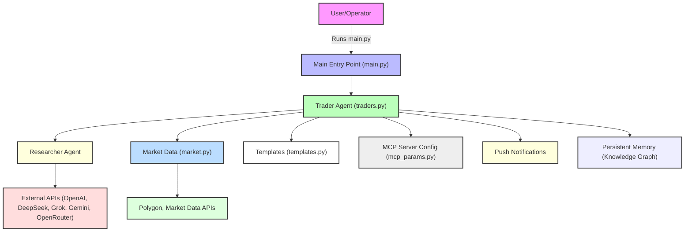

# 🚀 MCP Autonomous Traders

> **A modular, AI-powered framework for autonomous trading and financial research.**

---


---

## ✨ Overview
MCP Autonomous Traders is a next-generation Python framework for building, running, and experimenting with autonomous trading agents. It empowers both researchers and traders to automate research, trading, and portfolio management using state-of-the-art LLMs and real-time market data.

---

## 🛠️ Features
- **Modular agent & tool architecture**
- **Multi-LLM support:** OpenAI, DeepSeek, Grok, Gemini, OpenRouter
- **Researcher & trader agent roles**
- **Persistent memory & knowledge graph**
- **Automated trading & rebalancing workflows**
- **Push notifications & reporting**
- **.env-based configuration for API keys**

---

## 🖼️ Project Flow



---

## 📦 Project Structure

```
main.py         # Entry point
traders.py      # Trader agent logic
templates.py    # Prompt and message templates
market.py       # Market data logic
mcp_params.py   # MCP server configuration
```

---

## ⚡ Quickstart

### 1. Clone the repository
```sh
git clone <your-repo-url>
cd mcp-autonomous-traders
```

### 2. Install dependencies with [uv](https://github.com/astral-sh/uv)
```sh
uv add openai python-dotenv
```
_Add any additional dependencies as needed:_
```sh
uv add <package-name>
```

### 3. Configure environment variables
Create a `.env` file in the project root:
```
OPENAI_API_KEY=your-openai-key
DEEPSEEK_API_KEY=your-deepseek-key
GROK_API_KEY=your-grok-key
GOOGLE_API_KEY=your-google-key
OPENROUTER_API_KEY=your-openrouter-key
BRAVE_API_KEY=your-brave-key
POLYGON_API_KEY=your-polygon-key
```

---

## ▶️ Usage
Run the main entry point:
```sh
uv run main.py
```

---

## 🧩 Extending the Framework
- Add new agent types in `traders.py` or as new modules
- Customize prompts and workflows in `templates.py`
- Integrate new data sources via `market.py` and `mcp_params.py`

---

## 💬 Contact
For questions, suggestions, or contributions, please open an issue or contact the maintainer.

---

> _Empowering the next generation of autonomous trading and research._
