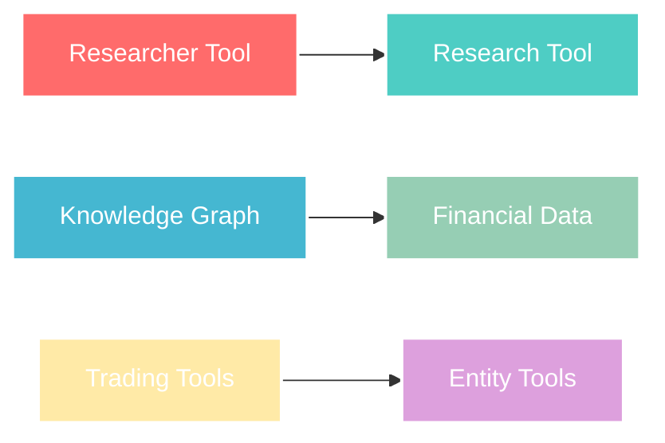
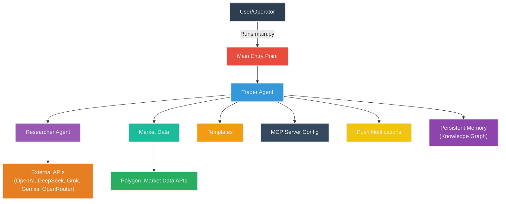

# MCP Autonomous Traders

<div align="center">

[](https://python.org)
[](https://modelcontextprotocol.io)
[](https://openai.com)

A modular, AI-powered framework for autonomous trading and financial research.

</div>

---

## Overview

MCP Autonomous Traders is a **next-generation Python framework** for building, running, and experimenting with autonomous trading agents. It empowers both researchers and traders to automate research, trading, and portfolio management using state-of-the-art LLMs and real-time market data.

### Key Benefits

- **AI-First Design**: Leverage multiple LLMs for intelligent decision-making
- **Real-Time Analytics**: Access live market data and historical analysis
- **Autonomous Operations**: Set-and-forget trading strategies
- **Modular Architecture**: Easily extensible and customizable
- **Modern UI**: Intuitive Gradio-based interface for monitoring

---

## Features

<table>
<tr>
<td width="50%">

### **Architecture**

- Modular agent & tool architecture
- Multi-LLM support\*\* (OpenAI, DeepSeek, Grok, Gemini, OpenRouter)
- Researcher & trader agent roles
- MCP server orchestration

</td>
<td width="50%">

### **Intelligence**

- Persistent memory & knowledge graph
- Automated trading & rebalancing workflows
- Push notifications & reporting
- Environment-based configuration

</td>
</tr>
</table>

---

## MCP Server & Tool Architecture

### MCP Servers

This project orchestrates multiple **Model Context Protocol (MCP)** servers to modularize and scale agentic workflows:

<div align="center">

| Server Type              | Purpose                            |
| ------------------------ | ---------------------------------- |
| Accounts Server          | Account data & resource management |
| Push Notification Server | Alerts & notifications             |
| Mark Data Server         | Real-time/historical market data   |
| Fet Server               | Web data retrieval                 |
| Brave Search Server      | Financial/news research            |
| Memory Server            | Persistent knowledge graph         |

</div>

### Agentic Tools

Agents leverage a comprehensive suite of AI-powered tools:



---

## Project Flow



---

## Project Structure

```
mcp-autonomous-traders/
├── main.py                 # Entry point
├── traders.py              # Trader agent logic
├── trading_floor.py        # Automated trading floor
├── app.py                  # Gradio-based UI
├── accounts.py             # Account management
├── util.py                 # UI utilities
├── reset.py                # Reset accounts & strategies
├── accounts_client.py      # Account MCP client
├── accounts_server.py      # Account MCP server
├── market_server.py        # Market data MCP server
├── push_server.py          # Push notification MCP server
├── market.py               # Market data logic
├── mcp_params.py           # MCP server configuration
├── tracers.py              # Tracing & logging
├── database.py             # Local database
└── templates.py            # Prompt templates
```

---

## Quickstart

### 1. Clone & Setup

```bash
git clone https://github.com/arneesh/mcp-autonomous-traders
cd mcp-autonomous-traders
```

### 2. Install Dependencies

```bash
# Using uv (recommended)
uv sync

# Add additional packages
uv add <package-name>
```

### 3. Configure Environment

Create a `.env` file in the project root:

```env
# LLM API Keys
OPENAI_API_KEY=your-openai-key
DEEPSEEK_API_KEY=your-deepseek-key
GROK_API_KEY=your-grok-key
GOOGLE_API_KEY=your-google-key
OPENROUTER_API_KEY=your-openrouter-key

# Data & Search APIs
BRAVE_API_KEY=your-brave-key
POLYGON_API_KEY=your-polygon-key
```

### 4. Launch

```bash
uv run app.py
uv run trading_floor.py
```

---

## Run Modes

<div align="center">

| Command                     | Description           | Use Case                        |
| --------------------------- | --------------------- | ------------------------------- |
| `uv run app.py`             | **Interactive UI**    | Real-time trading visualization |
| `uv run trading_floor.py`   | **Automated Trading** | Periodic agent execution        |
| `uv run reset.py`           | **Reset System**      | Clear accounts & strategies     |
| `uv run accounts_server.py` | **Account Server**    | Manage balances & trades        |
| `uv run market_server.py`   | **Market Server**     | Share price lookup              |
| `uv run push_server.py`     | **Push Server**       | Notifications via Pushover      |

</div>

---

## Extending the Framework

### Add New Agents

```python
# traders.py
class CustomTrader(BaseTrader):
    def __init__(self, config):
        super().__init__(config)
        self.strategy = "custom_strategy"
```

### Customize Prompts

```python
# templates.py
CUSTOM_PROMPT = """
Your custom trading prompt here...
"""
```

### Integrate Data Sources

```python
# market.py
def custom_data_source():
    # Your custom data integration
    pass
```

<div align="center">

</div>
